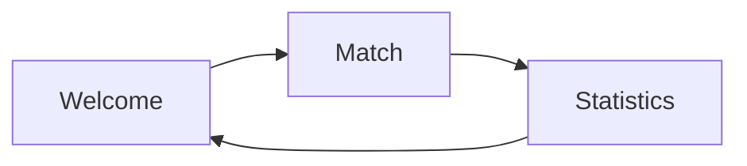
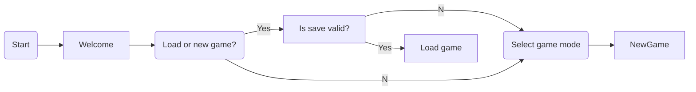
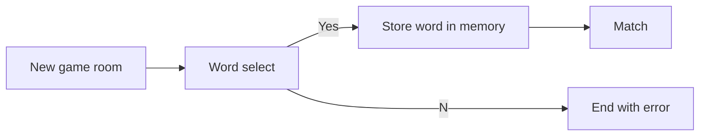
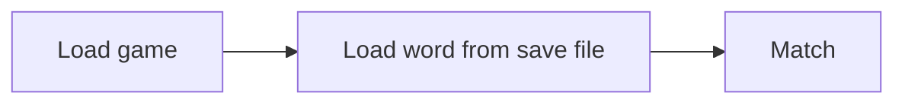
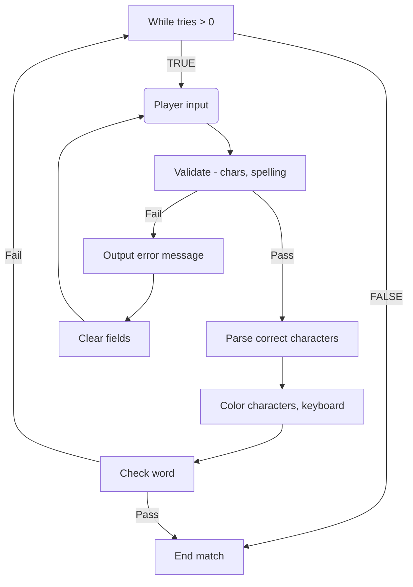
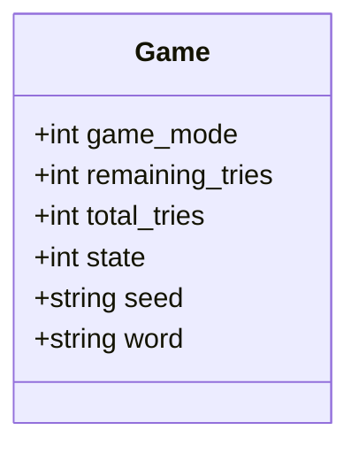
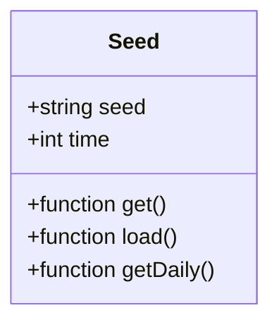
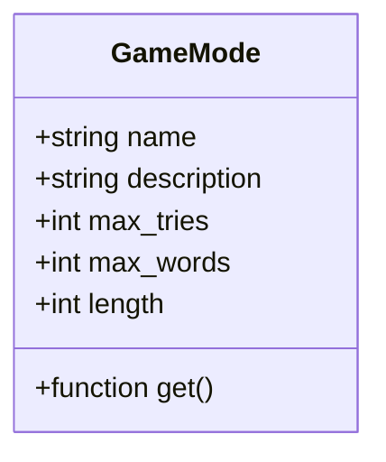

# php-Wordle

Design reference and notes. 

> This document is incomplete.

--- 

- [Features](#features)
  - [Wishlist](#wishlist)
- [User story](#user-story)
  - [Overview](#overview)
  - [Start](#start)
  - [New game](#new-game)
  - [Load game](#load-game)
  - [Match](#match)
  - [Statistics](#statistics)
  - [Options](#options)
- [Classes](#classes)
  - [Game()](#game)
  - [Seed()](#seed)
  - [GameMode()](#gamemode)
- [Game modes](#game-modes)

## Features

- 2 game modes
- Custom seeding for sycnhronous word selection
- On screen keyboard
- Player statistics
- Timer

### Wishlist

- [ ] Bundle with PHP binary 

## User story

### Overview

### Start

### New game

### Load game

### Match

### Statistics

- Played
- Win %
- Current Streak
- Max Streak
- Guess Distribution

### Options

- Hard Mode

## Classes

### Game()

### Seed()
    

### GameMode()

- Game modes are defined in `define/gamemodes.json`.

## Game modes

| Game mode | ID | Description |
| - | - | - |
| Daily | `0` | Daily game mode |
| Hard | `1` | Saved |
| Training | `2` | Unlimited |
